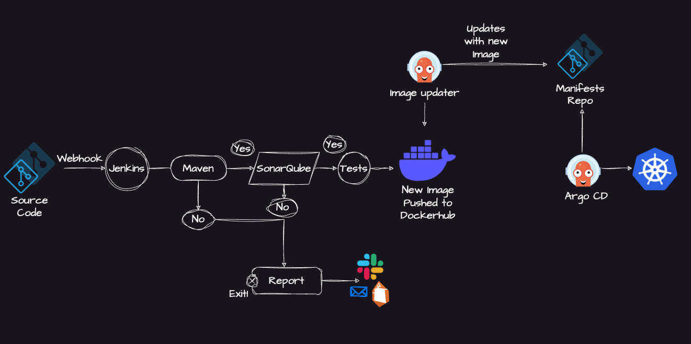
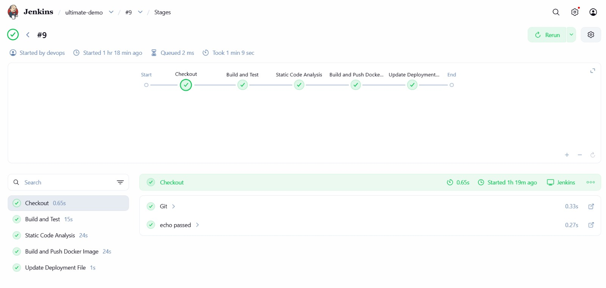
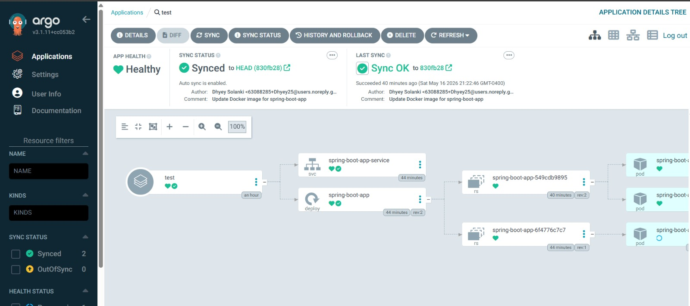

# End-to-End CI/CD Pipeline with Jenkins, SonarQube, Docker, and ArgoCD

A production-style CI/CD pipeline that automates the entire software delivery lifecycle — from code commit to Kubernetes deployment — using industry-standard DevOps tools.



---

## Project Overview

This project demonstrates a complete continuous integration and continuous deployment pipeline for a Java Spring Boot application. A developer pushes code to GitHub, which triggers Jenkins to build, test, analyze, containerize, and ultimately deploy the application to a Kubernetes cluster via GitOps.

The pipeline follows the **GitOps** methodology: Jenkins handles CI (build, test, scan, push), while ArgoCD handles CD by watching a Git repository for manifest changes and automatically syncing the desired state to the Kubernetes cluster.

---

## Architecture & Workflow

**CI (Continuous Integration) — Jenkins**

1. **Source Code Checkout** — Jenkins pulls the latest code from GitHub via webhook trigger.
2. **Build & Test** — Maven compiles the Java Spring Boot application and runs unit tests.
3. **Static Code Analysis** — SonarQube scans the codebase for bugs, vulnerabilities, and code smells.
4. **Containerization** — Docker builds the application image and pushes it to Docker Hub.
5. **Manifest Update** — Jenkins updates the Kubernetes deployment manifest with the new image tag and pushes it to the GitOps repository.

**CD (Continuous Deployment) — ArgoCD**

6. **GitOps Sync** — ArgoCD detects the manifest change and automatically deploys the updated application to the Kubernetes cluster running on Minikube.

---

## Tech Stack

| Layer | Tool | Purpose |
|-------|------|---------|
| CI Server | Jenkins | Pipeline orchestration |
| Build Tool | Maven | Java compilation, testing, packaging |
| Code Quality | SonarQube 10.4.1 | Static analysis, vulnerability detection |
| Containerization | Docker | Image build and registry push |
| Container Registry | Docker Hub | Image storage and distribution |
| GitOps Controller | ArgoCD v3.1.11 | Kubernetes-native continuous deployment |
| Orchestration | Kubernetes (Minikube) | Container orchestration |
| Infrastructure | AWS EC2 | Hosting Jenkins and SonarQube |
| SCM | GitHub | Source code and manifest management |

---

## Infrastructure Setup

### AWS EC2 Instance

- Jenkins and SonarQube run on an AWS EC2 instance.
- Security groups configured to expose ports 8080 (Jenkins) and 9000 (SonarQube).

### Kubernetes Cluster

- Minikube running locally with the Docker driver.
- ArgoCD installed via the ArgoCD Operator, managing deployments in the `default` namespace.

---

## Pipeline Stages in Detail

### 1. Checkout
Clones the application source code from the GitHub repository.

### 2. Build and Test
```bash
mvn clean package
```
Compiles the Spring Boot application and executes unit tests. Produces a deployable JAR artifact.

### 3. Static Code Analysis (SonarQube)
```bash
mvn sonar:sonar -Dsonar.login=$SONAR_AUTH_TOKEN -Dsonar.host.url=$SONAR_URL
```
Runs SonarQube analysis against the codebase. The pipeline uses a secure token stored in Jenkins credentials to authenticate with the SonarQube server.

### 4. Build and Push Docker Image
```bash
docker build -t dhyey25/ultimate-cicd:${BUILD_NUMBER} .
docker push dhyey25/ultimate-cicd:${BUILD_NUMBER}
```
Builds a Docker image tagged with the Jenkins build number and pushes it to Docker Hub.

### 5. Update Deployment Manifest
```bash
sed -i "s/replaceImageTag/${BUILD_NUMBER}/g" deployment.yml
git push
```
Updates the Kubernetes deployment manifest with the new image tag and pushes the change to the GitOps repository. ArgoCD detects this change and triggers a deployment.

---

## Screenshots

### Jenkins Pipeline — All Stages Passed


### ArgoCD — Application Synced and Healthy


---

## Key Challenges Solved

- **Java Version Compatibility** — SonarQube 10.4+ requires Java 17. Resolved by switching the Jenkins Docker agent from Java 11 to `maven:3.9.6-eclipse-temurin-17`.
- **Git Safe Directory** — Docker agent running as root conflicted with Git's `safe.directory` security. Fixed by adding `git config --global --add safe.directory` to the pipeline.
- **ArgoCD Service Type** — Changed ArgoCD server service from ClusterIP to NodePort via the ArgoCD custom resource for external access.
- **GitOps Image Reference** — Ensured the Kubernetes deployment manifest referenced the correct Docker Hub repository to prevent `ImagePullBackOff` errors.

---

## Jenkins Credentials Configuration

| Credential ID | Type | Purpose |
|---------------|------|---------|
| `sonarqube` | Secret Text | SonarQube authentication token |
| `docker-cred` | Username/Password | Docker Hub registry credentials |
| `github` | Secret Text | GitHub Personal Access Token for pushing manifest updates |

---

## How to Reproduce

### Prerequisites
- AWS EC2 instance (t2.medium or larger)
- Docker installed on EC2
- Minikube with Docker driver
- GitHub account with a forked copy of the repository

### Step 1 — Set Up Jenkins on EC2
```bash
# Install Java 17 and Jenkins
sudo apt update
sudo apt install openjdk-17-jdk -y
# Follow Jenkins installation docs for your OS
```

### Step 2 — Set Up SonarQube on EC2
```bash
adduser sonarqube
wget https://binaries.sonarsource.com/Distribution/sonarqube/sonarqube-10.4.1.88267.zip
unzip sonarqube-10.4.1.88267.zip -d /opt/
chown -R sonarqube:sonarqube /opt/sonarqube-10.4.1.88267
su - sonarqube -c "/opt/sonarqube-10.4.1.88267/bin/linux-x86-64/sonar.sh start"
```

### Step 3 — Set Up Minikube and ArgoCD
```bash
minikube start --driver=docker
# Install ArgoCD operator and create an ArgoCD instance
kubectl apply -f argocd-basic.yml
```

### Step 4 — Configure Jenkins Pipeline
- Add credentials (SonarQube token, Docker Hub, GitHub PAT).
- Create a pipeline job pointing to the forked repository's `Jenkinsfile`.
- Run the pipeline.

### Step 5 — Configure ArgoCD Application
- Create an ArgoCD application pointing to the manifests directory in the GitOps repository.
- Enable auto-sync for automatic deployments.

---

## Project Structure
```
├── java-maven-sonar-argocd-helm-k8s/
│   ├── spring-boot-app/
│   │   ├── src/                    # Application source code
│   │   ├── pom.xml                 # Maven build configuration
│   │   └── Dockerfile              # Container image definition
│   └── spring-boot-app-manifests/
│       └── deployment.yml          # Kubernetes deployment manifest
├── Jenkinsfile                     # CI pipeline definition
└── README.md
```

---

## Future Improvements

- Add **Helm charts** for templated Kubernetes deployments.
- Implement **quality gates** in SonarQube to fail the pipeline on critical issues.
- Add **Slack/email notifications** for build status.
- Set up **HTTPS/TLS** for Jenkins and SonarQube.
- Implement **RBAC** and namespace isolation in Kubernetes.
- Add **integration and end-to-end tests** as pipeline stages.

---

## Author

**Dhyey Solanki**

Built as a hands-on DevOps project demonstrating end-to-end CI/CD pipeline design, infrastructure provisioning, and GitOps-based deployment.
